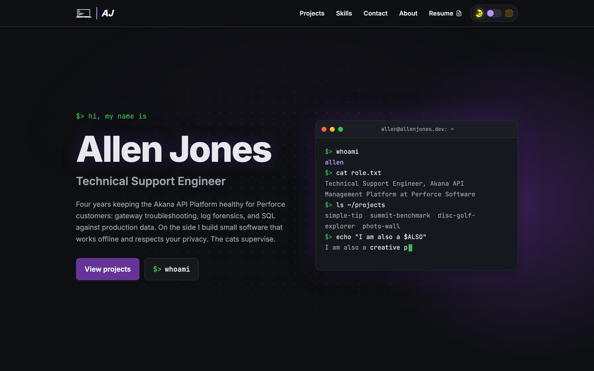

# allenjones.dev

My Personal portfolio website. Live at
https://www.allenjones.dev.

A showcase of my current technical skills and personal projects, as well as some info about who I am. And cat pictures. Lots of cat pictures. Even if you don't care about what I'm up to, check out the cat pictures.

## Stack

Vanilla HTML, CSS, and JavaScript. No framework, no build step, no package.json.
Dark by default with a light theme toggle, persisted in `localStorage`. 

Hosted on Netlify.

## Screenshot

## Contact form

The contact form uses Netlify Forms. Form detection is on and an email notification fires on each submission. This deprecates the prior use of Formspree in the previous design.

## Credits

The hero typing effect is adapted from a CodePen by CheeseTurtle:
https://codepen.io/CheeseTurtle/pen/AYJYqE

The accent color is `rebeccapurple`, a named CSS color added in 2014 in memory of Rebecca
Meyer.

This project has been developed with AI assistance (Claude Code).
